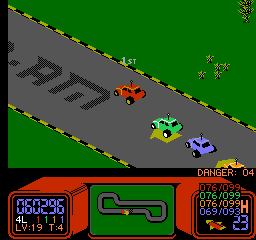

R.C. Pro-Am Enhanced HUD
========================
This FCEUX Lua script provides an enhanced HUD for R.C. Pro-Am.

Screenshot
==========

Explanation
===========
The HUD replaces a number of items with more detailed counterparts.

Lap Counter
-----------
The lap counter has been expanded to show what lap each car is on.
`#L` represents the number of laps in the race.

Level Display
-------------
The level display now includes the base track design. `LV:##` is the level
number as displayed by the game, and `T:#` is the actual track design.

Orange Car Danger Alert
-----------------------
One thing to watch out for in R.C. Pro-Am is the orange car. If you manage to
destroy 10 cars with weapons, the orange car will go extremely fast.

The counter just below the race screen lets you know how many cars have been
killed (`DANGER: ##`) or if the orange car is angry (`ORANGE CAR MAD`).

Speed
-----
The speedometer now shows the current and maximum speeds for each car.

To-Do
=====
* Show the number of continues on the continue screen
* Other things???
